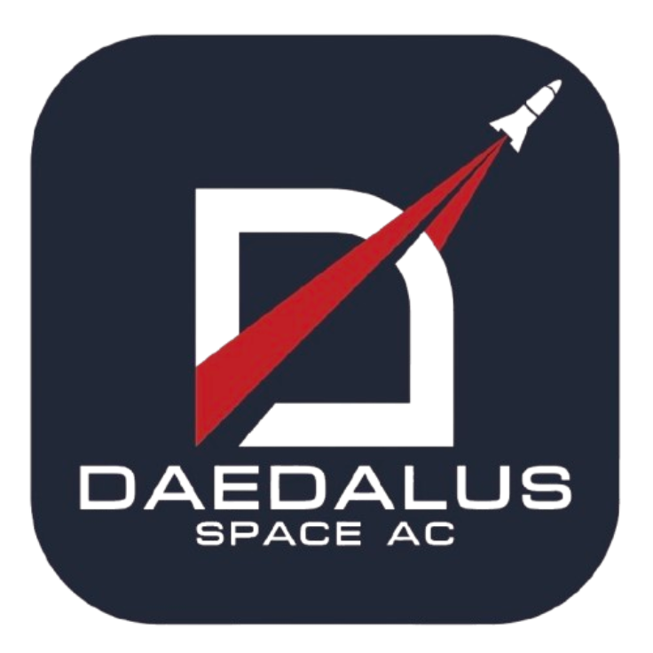

# Daedalus Ground Station (Team #1043)




**Daedalus Ground Station** is a comprehensive mission control interface designed for **CanSat Team #1043**. It provides real-time telemetry visualization, command uplink capabilities, and GPS tracking to monitor the payload during flight operations.

The system is built with a robust **Python FastAPI** backend for hardware communication and data logging, paired with a responsive **web-based frontend** for data visualization.

---

## Features

*   **Real-time Telemetry Dashboard:** Live monitoring of Altitude, Temperature, Pressure, Voltage, Current, and IMU data (Gyro/Accel).
*   **GPS Tracking:** Interactive map integration using Leaflet.js to track the payload's location.
*   **Command Uplink:** Send commands (e.g., `CX,ON`, `SIM,ENABLE`) directly to the CanSat via serial connection.
*   **Data Logging:**
    *   **Flight Data:** Automatically saves telemetry to CSV format (`data/Flight_1043.csv`).
    *   **System Logs:** Records operational events to JSONL (`logs/ground.jsonl`).
*   **Dynamic Configuration:** Flexible telemetry parsing defined in `telemetry_config.json`.
*   **Simulation Mode:** Built-in tools to replay flight data or generate dummy telemetry for testing and practice.
*   **Autonomous Audio Assistant:** Utilizes Text-To-Speech to actively announce flight states, system diagnostics, and mission success.
*   **Recovery Mode:** Dedicated GPS navigation UI with turn-by-turn voice directions to locate the CanSat post-landing.

---

## COTS Hardware Configuration
This Ground Station leverages standard Commercial Off-The-Shelf (COTS) components to ensure cost-friendly repeatability:
*   **Computing Core:** Raspberry Pi 4B (2GB+ RAM)
*   **Display:** Waveshare 4.3" HDMI LCD (800x480 resolution)
*   **Radio Transceiver:** XBee / LoRa Module (via USB Serial)
*   **Location Tracking:** External USB GPS Module (used for calculating dynamic recovery directions)
*   **Input:** Rii K01X1 Mini Wireless Keyboard

---

## Tech Stack

### Backend
*   **Language:** Python 3.8+
*   **Framework:** [FastAPI](https://fastapi.tiangolo.com/) (with Uvicorn)
*   **Communication:** `pyserial`, `websockets`

### Frontend
*   **Core:** HTML5, CSS3, Vanilla JavaScript
*   **Advanced APIs:** `window.speechSynthesis` (Audio TTS), `navigator.geolocation` (External GPS routing)
*   **Visualization:**
    *   [ECharts](https://echarts.apache.org/) (Real-time charts)
    *   [Leaflet](https://leafletjs.com/) (Maps)

---

## Installation

1.  **Clone the repository:**
    ```bash
    git clone https://github.com/Crazyexs/DDL-JS.git
    cd DDL-JS
    ```

2.  **Set up a Virtual Environment (Recommended):**
    ```bash
    # Windows
    python -m venv venv
    venv\Scripts\activate

    # macOS/Linux
    python3 -m venv venv
    source venv/bin/activate
    ```

3.  **Install Dependencies:**
    ```bash
    pip install -r requirements.txt
    ```

---

## Usage

1.  **Connect the Radio Transceiver:**
    Plug your LoRa/Serial radio into the USB port. Update the `DEFAULT_PORT` in `main.py` if necessary (default is `COM3` for Windows).

2.  **Start the Server:**
    ```bash
    # Windows
    .\venv\Scripts\python.exe -m uvicorn main:app --host 0.0.0.0 --port 8080
    
    # Linux/Mac
    ./venv/bin/uvicorn main:app --host 0.0.0.0 --port 8080
    ```

3.  **Access the Dashboard:**
    Open your web browser and navigate to:
    > **http://localhost:8080**

4.  **Remote Access (Optional) with ngrok:**
    To make your Ground Station accessible over the internet, you can use [ngrok](https://ngrok.com/).

    *   **Installation:** Download ngrok from their [official website](https://ngrok.com/download) or install it via a package manager (e.g., Chocolatey on Windows: `choco install ngrok`).
    *   **Setup:** Follow ngrok's instructions to authenticate your client with your auth token.
    *   **Run ngrok:** In a **new terminal window**, run:
        ```bash
        ngrok http 8080
        ```
    *   ngrok will provide a public URL (e.g., `https://xxxx-xxxx-xxxx-xxxx.ngrok-free.app`) that you can use to access your dashboard remotely.

9.  **Simulation (Optional):**
    If you don't have hardware connected, click the **Run Sim** button in the UI or use the API to start the dummy data generator.

---

## API Endpoints

The FastAPI backend exposes the following local endpoints utilized by the frontend:

### Data & Diagnostics
| Method | Endpoint | Description |
| :--- | :--- | :--- |
| `GET` | `/api/health` | Returns Ground Station status, serial port health, and audio diagnostic flags. |
| `GET` | `/ws/telemetry` | Primary WebSocket outputting live telemetry and GS logs. |
| `GET` | `/api/logs` | Fetches the latest system-level operational logs (JSONL). |

### Serial Management
| Method | Endpoint | Description |
| :--- | :--- | :--- |
| `GET` | `/api/serial/ports` | Lists all available system COM/TTY ports. |
| `GET` | `/api/serial/bauds` | Lists available baud rates. |
| `GET`/`POST` | `/api/serial/config` | Retrieves or sets the active serial connection configuration. |

### Commands & Simulation
| Method | Endpoint | Description |
| :--- | :--- | :--- |
| `POST` | `/api/command` | Uplinks a specific command string (e.g. `CX,ON`) to the CanSat via Serial. |
| `POST` | `/api/sim/start` | Starts SIM mode, uplinking local pressure CSV data to the CanSat. |
| `POST` | `/api/dummy/start` | Starts the UI dummy visualizer (fakes a launch, descent, and landing). |
| `POST` | `/api/dummy/stop` | Stops the UI dummy visualizer. |

### Logs & Intake
| Method | Endpoint | Description |
| :--- | :--- | :--- |
| `POST` | `/api/ingest` | Manual HTTP ingestion endpoint for telemetry lines (bypasses Serial). |
| `POST` | `/api/csv/save-now` | Forces an immediate write of the current telemetry buffer to the CSV. |
| `GET` | `/api/csv/open-folder`| Opens the local OS File Explorer directly to the `data/` log folder. |

---

## Branches

This project maintains two branches for different deployment scenarios:

| Branch | Target Platform | Description |
| :--- | :--- | :--- |
| `main` | **Laptop/Desktop** (Windows, macOS, Linux) | Standard UI for larger screens. |
| `raspberry-pi` | **Raspberry Pi** (4.3" 800x480 Display) | Compact UI optimized for small screens, plus auto-start scripts. |

### Raspberry Pi Deployment (Mark Walker Award Hardware)

The `raspberry-pi` branch is designed for the portable ground station using:
- **Raspberry Pi 4**
- **Waveshare 4.3" HDMI LCD (800x480)**
- **Rii K01X1 Mini Wireless Keyboard**

**Quick Setup:**
```bash
# Clone the repo and switch to the Pi branch
git clone https://github.com/Crazyexs/DDL-JS.git
cd DDL-JS
git checkout raspberry-pi

# Run the one-time setup script
sudo bash scripts/setup-pi.sh

# Reboot - the ground station will start automatically!
sudo reboot
```

---

## Project Structure

```text
DDL-JS/
├── main.py                 # Core backend logic (Server, Serial, Logging)
├── requirements.txt        # Python dependencies
├── telemetry_config.json   # Telemetry parsing configuration
├── data/                   # Stores flight CSV data
├── logs/                   # Stores system operation logs
├── scripts/                # Deployment scripts (raspberry-pi branch only)
│   ├── setup-pi.sh         # One-time Pi setup script
│   └── autostart/
│       ├── groundstation.service  # Systemd service for backend
│       └── kiosk.sh               # Chromium kiosk launcher
└── ui/                     # Web frontend source code
    ├── index.html          # Main dashboard layout
    ├── app.js              # Frontend logic
    ├── styles.css          # Styling (includes 800x480 responsive rules)
    └── assets/             # Images and icons
```

## API Endpoints

The backend exposes several endpoints for control and integration:

| Method | Endpoint | Description |
| :--- | :--- | :--- |
| `POST` | `/api/command` | Queue a command for uplink to the CanSat. |
| `GET` | `/api/logs` | Retrieve the latest system logs. |
| `POST` | `/api/sim/start` | Start the pressure data simulation. |
| `POST` | `/api/dummy/start` | Enable internal dummy data generation. |
| `GET` | `/api/health` | Check system status (Serial connection, RX count). |

---

## Commercial Off-The-Shelf (COTS) Software

This project utilizes the following third-party software packages and libraries:

### Backend (Python)
*   **[FastAPI](https://fastapi.tiangolo.com/):** High-performance web framework for building APIs.
*   **[Uvicorn](https://www.uvicorn.org/):** Lightning-fast ASGI server implementation.
*   **[PySerial](https://pyserial.readthedocs.io/):** Python serial port access library for hardware communication.
*   **[Pydantic](https://docs.pydantic.dev/):** Data validation and settings management using Python type hints.
*   **[Aiofiles](https://github.com/Tinche/aiofiles):** File support for asyncio.
*   **[Python-Multipart](https://github.com/Kludex/python-multipart):** Streaming multipart parser for Python.

### Frontend (JavaScript)
*   **[ECharts](https://echarts.apache.org/):** A powerful, interactive charting and visualization library.
*   **[Leaflet.js](https://leafletjs.com/):** An open-source JavaScript library for mobile-friendly interactive maps.

### External Tools
*   **[ngrok](https://ngrok.com/):** A tool to expose a local web server to the internet (used for remote access).
